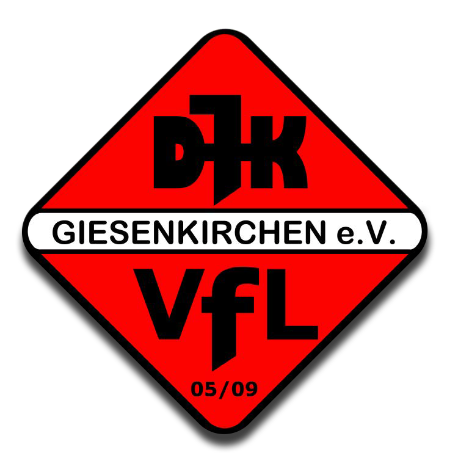

<p align="center">
  
</p>

# DJK/VfL Giesenkirchen 05/09 e.V. – Vereinswebsite

Die Anwendung ist die digitale Vereinsplattform der **DJK/VfL Giesenkirchen 05/09 e.V.** Sie verbindet die öffentliche Vereinswebsite mit einem geschützten, rollen- und berechtigungsbasierten Verwaltungsdashboard.

> **Status:** PRODUKTIV / LIVE
>
> **Live-Website:** [djkvfl-giesenkirchen.de](https://djkvfl-giesenkirchen.de)
>
> **Go-live:** September 2026
>
> **Dokumentationsstand:** 30. September 2026

## Funktionsumfang

### Öffentliche Website

- Vereinsinformationen, Vereinsgeschichte, Vorstand und Ansprechpartner
- Abteilungsbereiche für Fußball, Tischtennis, Gymnastikdamen und Behindertensport
- Fußball- und Tischtennismannschaften mit Kadern, Trainern und Trainingszeiten
- News, Termine, Trainingstermine und öffentliche Ergebnisdarstellung
- Downloads, Kontakte, Mitglied-werden-Bereich und öffentliche Formulare
- FUSSBALL.DE-Widgets sowie serverseitige myTischtennis-/click-TT-Anbindung
- responsive Darstellung für Desktop, Tablet und Mobile
- Consent-Manager, Accessibility-/Performance-Grundlagen und rechtliche Seiten
- produktive SEO-Metadaten, Sitemap, `robots.txt` und freigegebene Suchmaschinenindexierung

### Internes Dashboard

- Supabase-Authentifizierung mit Einladungs-, Login-, Recovery- und Profilfunktionen
- Rollen, granulare Permissions sowie Gesamtvereins-, Abteilungs- und Mannschaftsscope
- Benutzer-, Rollen- und Berechtigungsverwaltung
- Pflege von News, Terminen, Downloads, Ergebnissen und allgemeinen Website-Inhalten
- Verwaltung von Mannschaften, Spielern, Trainern, Vorständen und Abteilungen
- Mitgliedsanfragen, Beitragsverwaltung, Sponsoren, Medien und Vereinschronik
- Dashboard-Benachrichtigungen, persönliche Präferenzen und steuerbarer E-Mail-Versand
- Support-/Ticketsystem mit Nachrichtenverlauf, Status, Priorität, Zuweisung und Benachrichtigungen

Im Projekt sind die Rollen `superadmin`, `vorstand`, `fussball-vorstand`, `tischtennis-vorstand`, `damen-gymnastik-vorstand`, `behindertensport-vorstand`, `jugendleiter`, `trainer`, `betreuer`, `redakteur`, `kassierer`, `webmaster` und `gast` definiert. Der tatsächliche Zugriff ergibt sich zusätzlich aus den zugewiesenen Permissions und dem jeweiligen Fachscope.

## Produktionsstatus

| Bereich | Status |
| --- | --- |
| Öffentliche Website | Produktiv |
| HTTPS | Aktiv |
| Dashboard | Produktiv |
| Authentifizierung und Recovery | Produktiv |
| Rollen- und Berechtigungssystem | Produktiv |
| Anwendungs- und Notification-Mails | Produktiv |
| Support-/Ticketsystem | Produktiv |
| FUSSBALL.DE | Aktiv |
| myTischtennis / click-TT | Aktiv |
| SEO, Sitemap und `robots.txt` | Aktiv |
| Suchmaschinenindexierung | Freigegeben |
| Responsive Design | Produktiv |

Der technische und organisatorische Go-live ist abgeschlossen. Der aktuelle Detailstand ist im [Projektstatus](docs/planning/project-status.md) dokumentiert.

## Technik-Stack

- **Frontend und Backend:** Next.js 16 App Router, React 19
- **Styling:** Tailwind CSS 4
- **Daten und Authentifizierung:** Supabase, PostgreSQL, Supabase Auth und Storage
- **Redaktionelle Inhalte:** TinyMCE
- **E-Mail:** Resend sowie separates Supabase Auth SMTP
- **Betrieb:** Node.js 24 auf Hetzner Webhosting
- **Versionsverwaltung und Deployment:** GitHub und GitHub Actions

## Architektur

```text
Öffentliche Website ─┐
                     ├─> Next.js ─> serverseitige Services ─> Supabase / PostgreSQL
Dashboard ─> Auth ───┘                      │
       └─> Rollen + Permissions + Scope ────┘

Anwendung ─> zentraler Mail-Service ─> Resend
GitHub ─> GitHub Actions ─> Hetzner
```

Privilegierte Änderungen werden serverseitig autorisiert. Dabei werden Session, Permission und Fachscope geprüft; ein technischer Datenbankzugang ersetzt keine fachliche Berechtigung. Datenbankänderungen sind bewusst vom Deployment getrennt und folgen einem dokumentierten Preflight-/Proposal-/Rollback-/Postcheck-Verfahren.

## Deployment

Die Produktionsumgebung läuft bei Hetzner unter [djkvfl-giesenkirchen.de](https://djkvfl-giesenkirchen.de). Ein Push auf `master` startet den bestehenden GitHub-Actions-Workflow, der den exakten Commit isoliert installiert und baut. Nach erfolgreichem Workflow ist derzeit weiterhin ein **manueller Node.js-Neustart in konsoleH** erforderlich.

Zugangsdaten, Schlüssel und Environment-Werte werden nicht im Repository dokumentiert. Der vollständige Betriebs- und Sicherheitsvertrag steht in der [Deployment-Dokumentation](docs/development/deployment.md).

## Laufende Weiterentwicklung

Die Website ist produktiv und wird weiter gepflegt. Aktuelle nicht blockierende Punkte sind insbesondere:

- **Automatische Beitragserinnerungen: NICHT AKTIV / BEWUSST ZURÜCKGESTELLT.** Die Aktivierung erfolgt erst nach eingerichtetem Kassiererzugang sowie vollständiger Einpflege und Kontrolle der echten Beitragsdaten.
- redaktionelle Nachpflege einzelner Inhalte und Rollendetails
- optionale Qualitäts-, Provider- und UX-Verbesserungen gemäß Roadmap

Abgeschlossene Go-live-Aufgaben werden nicht als offene Arbeiten weitergeführt. Maßgeblich ist die [aktuelle Roadmap](docs/planning/current-roadmap.md).

## Projektstruktur

| Pfad | Zweck |
| --- | --- |
| `src/app` | Next.js-Routen, Layouts, Route Handler und Metadata-Dateien |
| `src/components` | öffentliche und administrative UI-Module |
| `src/lib` | Fachlogik, serverseitige Services, Auth-, Mail- und Providerintegration |
| `src/config` | zentrale, nicht geheime Anwendungskonfiguration |
| `public` | versionierte statische Assets, darunter das Vereinslogo |
| `docs` | Architektur-, Modul-, Betriebs-, Planungs- und SQL-Dokumentation |
| `scripts` | kontrollierte Hilfs- und Deploymentskripte |
| `supabase` | versionierte Supabase-Artefakte und historische Migrationen |

## Lokale Entwicklung

Voraussetzung ist eine unterstützte Node.js-/npm-Umgebung. Abhängigkeiten werden reproduzierbar über das Lockfile installiert:

```bash
npm ci
npm run dev
```

Die lokale Anwendung ist anschließend standardmäßig unter `http://localhost:3000` erreichbar. Notwendige lokale Environment-Konfiguration gehört in nicht versionierte Environment-Dateien; echte Werte werden nicht in die README übernommen.

### Relevante Befehle

```bash
npm run dev                 # Entwicklungsserver
npm run build               # Production-Build inklusive TypeScript-Prüfung
npm run start               # gebaute Anwendung starten
npm run lint                # ESLint
npm run audit:admin-routes  # Admin-Routen-/Permission-Audit
```

Fokussierte Tests werden in diesem Projekt mit dem nativen Node.js-Test-Runner ausgeführt, beispielsweise mit `node --test <testdatei>`. Ein allgemeines `npm test`-Script ist derzeit nicht definiert.

## Dokumentation

- [Dokumentationsübersicht](docs/README.md)
- [Projektstatus](docs/planning/project-status.md)
- [Aktuelle Roadmap](docs/planning/current-roadmap.md)
- [Project Health](docs/development/project-health.md)
- [Deployment](docs/development/deployment.md)
- [Changelog](docs/changelog.md)
- [Architekturübersicht](docs/architecture/overview.md)
- [Website-Moduldokumentation](docs/modules/website.md)

Die README dient als Einstiegspunkt. Fachliche Detailverträge, Security-Nachweise und historische Datenbankartefakte verbleiben in der jeweiligen Dokumentation unter `docs/`.

## Sicherheit

Dieses Repository darf keine API-Keys, Tokens, Passwörter, privaten SSH-Schlüssel, SMTP-Zugangsdaten, Supabase-Secrets, Cron-Secrets oder personenbezogenen Daten enthalten. Secrets verbleiben ausschließlich in den dafür vorgesehenen lokalen beziehungsweise produktiven Konfigurationen.
